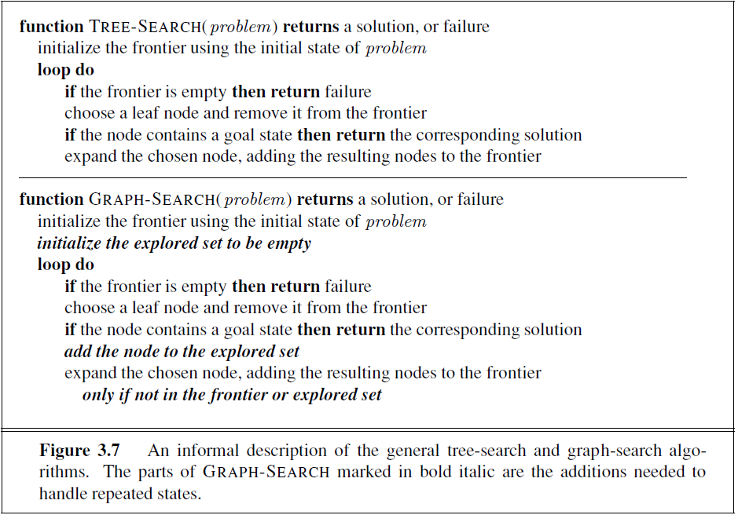

# 第一週建議作業

1. 不管是使用 DFS 或者 BFS 來找尋從甲地到乙地的路線時，都不一定可以找到最短路線。說明原因。
2. 參考 AIMA 第三章的圖 3.2 的地圖，依照圖 3.7 (graph-search) 和 3.11 的 BFS 演算法來找 Sibiu 到 Bucharest 的路線，最少要執行圖 3.7 (或者圖3.11)的 loop do 內容幾次？所找到的路線是最短的路線嗎？
3. 參考 AIMA 第三章的圖 3.2 的地圖，依照圖 3.7 (graph-search) 和 3.11 的 BFS 演算法來找 Sibiu 到 Bucharest 的路線，執行圖 3.7 (或者圖3.11)的 loop do 內容的次數可不可能超過3次？
4. 參考 AIMA 第三章的圖 3.2 的地圖，依照圖 3.7 (graph-search) 和 3.11 的 DFS 演算法，並且參考第85頁上所說的(whereas breadth-first-search uses a FIFO queue, depth-first search uses a LIFO queue)來找 Sibiu 到 Bucharest 的路線，最少要執行圖 3.7 (或者圖3.11) 的 loop do 內容幾次？所找到的路線是最短的路線嗎？ _備註：圖3.11原本是 BFS，經過文字說明的修改之後，變成了 DFS_
5. 參考 AIMA 第三章的圖 3.2 的地圖，依照圖 3.7 (graph-search) 和 3.11 的 DFS 演算法，並且參考第85頁上所說的(whereas breadth-first-search uses a FIFO queue, depth-first search uses a LIFO queue)來找 Arad 到 Bucharest 的路線，執行圖 3.7 (或者圖3.11) 的 loop do 內容有沒有可能超過五次？ _備註：圖3.11原本是 BFS，經過文字說明的修改之後，變成了 DFS_
6. 參考 AIMA 第三章的圖 3.2 的地圖，依照圖 3.7 (graph-search) 和 3.11 的 DFS 演算法，並且參考第85頁上所說的(whereas breadth-first-search uses a FIFO queue, depth-first search uses a LIFO queue)來找 Sibiu 到 Bucharest 的路線，執行圖 3.7 (或者圖3.11) 時，如果絕對不重複經過同一個都市的話，有沒有可能找不到答案？ _備註：圖3.11原本是 BFS，經過文字說明的修改之後，變成了 DFS_
  1. 如果找不到答案的話，課本的演算法能不能自己停下來？會在哪裡停止？

## figures





## 1.

DFS、BFS 的設計是單純的貪婪法邏輯，只能找到甲地到乙地可能之路徑，例如最少經過的路徑，無法找到最短的路徑。要找最短的路徑，需要至少針對路徑長度進行權重分析與排序，才有可能找得到。


```python
# 2.

from collections import namedtuple

Node = namedtuple('Node', ['name', 'children'])
Path = namedtuple('Path', ['nodes', 'size'])

NULL = Node('', [])

def build_node(name):
    node = Node(name, [])
    return node


def build_nodes():
    cities = ['Arad', 'Bucharest', 'Craiova', 'Drobeta', 'Fagaras', 
              'Lugoj', 'Mehadia', 'Oradea', 'Pitesti', 'Rimnicu Vilcea',
              'Sibiu', 'Timisoara', 'Zerind', 'VOID']
    return {city: build_node(city) for city in cities}

        
def link_nodes(nodes, start, *ends):
    start_node = nodes[start]
    for end in ends:
        start_node.children.append(nodes[end])
        # end.parent = start

def build_bfs_map():
    nodes = build_nodes()
    
    # 以下是 Sibiu -> Bucharest 範圍內, 12 個 Nodes 之間關係，沒有 Bucharest 作 Start
    link_nodes(nodes, 'Sibiu', 'Fagaras', 'Rimnicu Vilcea', 'Oradea', 'Arad')  ## 作弊用，把 Fagaras 放前面，它 SF 就有優先選徑權
    link_nodes(nodes, 'Fagaras', 'Bucharest', 'Sibiu')  ## 作弊用，把 Bucharest 放前面，並把 backward 方向之 Sibiu 放後面
    link_nodes(nodes, 'Rimnicu Vilcea', 'Pitesti', 'Craiova', 'Sibiu')
    link_nodes(nodes, 'Oradea', 'Zerind', 'Sibiu')
    link_nodes(nodes, 'Arad', 'Zerind', 'Timisoara', 'Sibiu')
    link_nodes(nodes, 'Zerind', 'Oradea', 'Arad')
    link_nodes(nodes, 'Timisoara', 'Lugoj', 'Arad')
    link_nodes(nodes, 'Lugoj', 'Mehadia', 'Timisoara')
    link_nodes(nodes, 'Mehadia', 'Drobeta', 'Lugoj')
    link_nodes(nodes, 'Drobeta', 'Craiova', 'Mehadia')
    link_nodes(nodes, 'Craiova', 'Pitesti', 'Rimnicu Vilcea', 'Drobeta')
    link_nodes(nodes, 'Pitesti', 'Bucharest', 'Rimnicu Vilcea', 'Craiova')
    
    return nodes['Sibiu']


def valid_path(path, start_name, end_name):
    start = path.nodes[0]
    end = path.nodes[-1]

    return start.name == start_name and end.name == end_name


def extend_path(path):
    paths = []
    path_nodes = path.nodes
    start = path_nodes[0]
    end = path_nodes[-1]
    children_of_end = end.children

    size = path.size
    
    for child in children_of_end:
        new_nodes = path_nodes.copy()
        new_nodes.append(child)
        paths.append(Path(new_nodes, size + 1))
        
    return paths


def bfs(frontier, es, times):
    if len(frontier) == 0 or frontier is None:
        raise Exception()
    else:
        path = frontier.pop(0)

        if valid_path(path, 'Sibiu', 'Bucharest'):
            return path, times
        else:
            es.append(path)
            frontier.extend(extend_path(path))
            return bfs(frontier, es, times + 1)

start = build_bfs_map()
path, times = bfs([Path([start, start], 0)], [], 0)

print('2.')

print('BFS 路徑：')
for node in path.nodes:
    print(node.name)

print("最少執行步數：", times)
print("本路徑非最短路徑")
```

    2.
    BFS 路徑：
    Sibiu
    Sibiu
    Fagaras
    Bucharest
    最少執行步數： 5
    本路徑非最短路徑
    

## 3.

由以上程式實驗可證，會超過 3 次


```python
## 4.

def build_dfs_map():
    nodes = build_nodes()
    
    # 以下是 Sibiu -> Bucharest 範圍內, 12 個 Nodes 之間關係，沒有 Bucharest 作 Start
    link_nodes(nodes, 'Sibiu', 'Rimnicu Vilcea', 'Oradea', 'Arad', 'Fagaras')  ## 作弊用，把 Fagaras 放後面，它 SF 就有優先選徑權
    link_nodes(nodes, 'Fagaras', 'Sibiu', 'Bucharest')  ## 作弊用，把 Bucharest 放後面，並把 backward 方向之 Sibiu 放前面
    link_nodes(nodes, 'Rimnicu Vilcea', 'Pitesti', 'Craiova', 'Sibiu')
    link_nodes(nodes, 'Oradea', 'Zerind', 'Sibiu')
    link_nodes(nodes, 'Arad', 'Zerind', 'Timisoara', 'Sibiu')
    link_nodes(nodes, 'Zerind', 'Oradea', 'Arad')
    link_nodes(nodes, 'Timisoara', 'Lugoj', 'Arad')
    link_nodes(nodes, 'Lugoj', 'Mehadia', 'Timisoara')
    link_nodes(nodes, 'Mehadia', 'Drobeta', 'Lugoj')
    link_nodes(nodes, 'Drobeta', 'Craiova', 'Mehadia')
    link_nodes(nodes, 'Craiova', 'Pitesti', 'Rimnicu Vilcea', 'Drobeta')
    link_nodes(nodes, 'Pitesti', 'Bucharest', 'Rimnicu Vilcea', 'Craiova')
    
    return nodes['Sibiu']


def extend_path_deeply(path):
    paths = []
    path_nodes = path.nodes
    start = path_nodes[0]
    end = path_nodes[-1]
    children_of_end = end.children

    size = path.size
    
    for child in children_of_end:
        new_nodes = path_nodes.copy()
        new_nodes.append(child)
        paths.append(Path(new_nodes, size + 1))
        
    return paths


def dfs(frontier, es, times, start_name, end_name):
    if len(frontier) == 0 or frontier is None:
        raise Exception('error!!!')
    else:
        path = frontier.pop()

        if valid_path(path, start_name, end_name):
            return path, times
        else:
            es.append(path)
            frontier.extend(extend_path(path))
            return dfs(frontier, es, times + 1, start_name, end_name)
        
start = build_dfs_map()
path, times = dfs([Path([start, start], 0)], [], 0, 'Sibiu', 'Bucharest')

print('4.')

print('DFS 路徑：')
for node in path.nodes:
    print(node.name)

print("最少執行步數：", times)
print("本路徑非最短路徑")
```

    4.
    DFS 路徑：
    Sibiu
    Sibiu
    Fagaras
    Bucharest
    最少執行步數： 2
    本路徑非最短路徑
    


```python
# 5.

def build_a_to_b_map():
    nodes = build_nodes()
    
    # 以下是 Sibiu -> Bucharest 範圍內, 12 個 Nodes 之間關係，沒有 Bucharest 作 Start
    link_nodes(nodes, 'Arad', 'Zerind', 'Timisoara', 'Sibiu')  ## 作弊用，把 Sibiu 放後面，它 AS 就有優先選徑權
    link_nodes(nodes, 'Sibiu', 'Arad', 'Rimnicu Vilcea', 'Oradea', 'Fagaras')  ## 作弊用，把 Fagaras 放後面，它 SF 就有優先選徑權
    link_nodes(nodes, 'Fagaras', 'Sibiu', 'Bucharest')  ## 作弊用，把 Bucharest 放後面，並把 backward 方向之 Sibiu 放前面
    link_nodes(nodes, 'Rimnicu Vilcea', 'Pitesti', 'Craiova', 'Sibiu')
    link_nodes(nodes, 'Oradea', 'Zerind', 'Sibiu')
    link_nodes(nodes, 'Zerind', 'Oradea', 'Arad')
    link_nodes(nodes, 'Timisoara', 'Lugoj', 'Arad')
    link_nodes(nodes, 'Lugoj', 'Mehadia', 'Timisoara')
    link_nodes(nodes, 'Mehadia', 'Drobeta', 'Lugoj')
    link_nodes(nodes, 'Drobeta', 'Craiova', 'Mehadia')
    link_nodes(nodes, 'Craiova', 'Pitesti', 'Rimnicu Vilcea', 'Drobeta')
    link_nodes(nodes, 'Pitesti', 'Bucharest', 'Rimnicu Vilcea', 'Craiova')
    
    return nodes['Arad']

start = build_a_to_b_map()
path, times = dfs([Path([start, start], 0)], [], 0, 'Arad', 'Bucharest')

print('5.')

print('DFS 路徑：')
for node in path.nodes:
    print(node.name)

print("最少執行步數：", times)
print("本路徑非最短路徑，且不超過 5 次")
```

    5.
    DFS 路徑：
    Arad
    Arad
    Sibiu
    Fagaras
    Bucharest
    最少執行步數： 3
    本路徑非最短路徑，且不超過 5 次
    


```python
def dfs_norepeat(frontier, es, traversed, times, start_name, end_name):
    if len(frontier) == 0 or frontier is None:
        raise Exception('error!!!')
    else:
        path = frontier.pop()

        if valid_path(path, start_name, end_name):
            return path, times
        elif path.nodes[-1].name in traversed:
            return dfs_norepeat(frontier, es, traversed, times + 1, start_name, end_name)
        else:
            es.append(path)
            traversed.add(path.nodes[-1].name)
            frontier.extend(extend_path(path))
            return dfs_norepeat(frontier, es, traversed, times + 1, start_name, end_name)

        
start = build_dfs_map()
path, times = dfs_norepeat([Path([start, start], 0)], [], set(), 0, 'Sibiu', 'Bucharest')

print('6.')

print('DFS 路徑：')
for node in path.nodes:
    print(node.name)

print("最少執行步數：", times)
print("還是找得到答案")
```

    6.
    DFS 路徑：
    Sibiu
    Sibiu
    Fagaras
    Bucharest
    最少執行步數： 2
    還是找得到答案
    


```python
print('7.')
try:
    start = build_dfs_map()
    path, times = dfs_norepeat([Path([start, start], 0)], [], set(), 0, 'Sibiu', 'VOID')
except Exception:
    print('當目標是一個未連通節點，便會發生錯誤')

```

    7.
    當目標是一個未連通節點，便會發生錯誤
    
