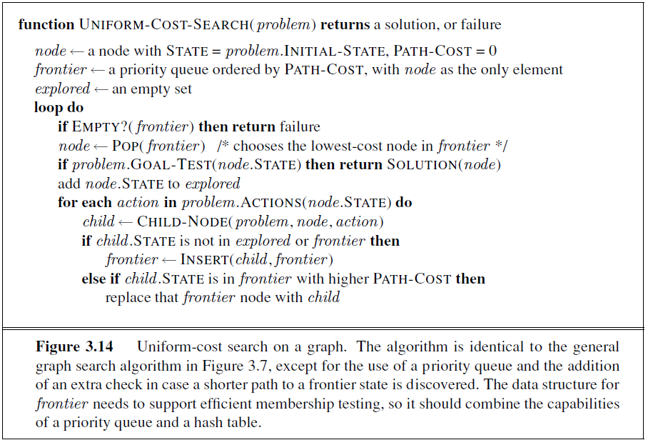
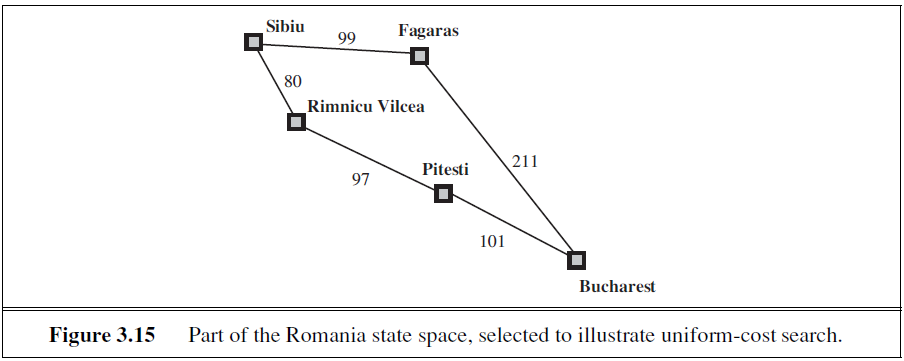

# 第二週建議作業

1. 以 UCS 找尋圖3.15中Sibiu 到 Bucharest 的最短路徑。
  1. 以圖3.7的標準來看，loop do 執行過多少次？
  1. 你的演算法停下來的時候，部分路線(partial path) S-F-B 有沒有在 frontier 裡面？
1. 假設我們有甲和乙兩個四面的骰子。丟擲甲骰子時，看到 1、2、3、4 的機率分別是 0.1、0.4、0.2、0.3。丟擲甲骰子時，看到 1、2、3、4 的機率分別是 0.3、0.2、0.4、0.1。依照這一些數據回答下列問題。
  1. 以這甲乙兩個骰子，在某一次試擲實驗，投擲其中一個，我們看到 3。這一個骰子是甲骰子的機率是多少？ 
  1. 以這甲乙兩個骰子，在某一次試擲實驗中，我們任意選擇了甲或者乙其中一個骰子，連續試擲兩次，我們看到 3 和 4。假設這兩次投擲是完全獨立的，則這一個骰子是甲骰子的機率是多少？
1. 以下這一題是補充上星期最後一題建議作業的。改變題目來點出要大家注意的地方。
  1. 現在我們使用以下這一個極度簡單也奇怪的地圖，其中 A、B 和 C 是三個地點。
  1. map 
  1. 以 AIMA 圖 3.7 的演算法，來實踐 BFS 或者 DFS，尋找從 A 到 C 的路線的話，顯然是一個沒有答案的問題。
  1. 但是程式如何知道沒有答案？
    1. 針對這一問題，圖 3.7 的演算法會停在甚麼地方？
    1. 停止的時候 frontier 的內容是甚麼？

## figures







```python
# 1
from collections import namedtuple

Node = namedtuple('Node', ['name', 'edges'])
Edge = namedtuple('Edge', ['start', 'end', 'length'])
Path = namedtuple('Path', ['nodes', 'length'])

NULL = Node('', [])

def build_node(name):
    node = Node(name, [])
    return node


def build_nodes():
    cities = ['Arad', 'Bucharest', 'Craiova', 'Drobeta', 'Fagaras', 
              'Lugoj', 'Mehadia', 'Oradea', 'Pitesti', 'Rimnicu Vilcea',
              'Sibiu', 'Timisoara', 'Zerind', 'VOID']
    return {city: build_node(city) for city in cities}

        
def link_nodes(nodes, start, end, length):
    start_node = nodes[start]
    end_node = nodes[end]
    start_node.edges.append(Edge(start_node, end_node, length))
    

def build_map():
    nodes = build_nodes()

    link_nodes(nodes, 'Sibiu', 'Fagaras', 99)
    link_nodes(nodes, 'Fagaras', 'Bucharest', 211)
    link_nodes(nodes, 'Sibiu', 'Rimnicu Vilcea', 80)
    link_nodes(nodes, 'Rimnicu Vilcea', 'Pitesti', 97)
    link_nodes(nodes, 'Pitesti', 'Bucharest', 101)
    
    
    return nodes['Sibiu']


def valid_path(path, start_name, end_name):
    start = path.nodes[0]
    end = path.nodes[-1]

    return start.name == start_name and end.name == end_name


def sort_paths(paths):
    if len(paths) == 1:
        return paths
    else:
        new_paths = paths.copy()
        for i in range(1, len(new_paths)):
            temp = new_paths[i]
            j = i - 1
            while j >= 0 and temp.length < new_paths[j].length:
                new_paths[j + 1] = new_paths[j]
                j -= 1
            new_paths[j + 1] = temp
            
        return new_paths


def extend_path(path):
    paths = []
    
    path_nodes = path.nodes
    start = path_nodes[0]
    end = path_nodes[-1]
    edges_of_end = end.edges
    
    orig_length = path.length
    
    for edge in edges_of_end:
        new_nodes = path_nodes.copy()
        new_nodes.append(edge.end)
        paths.append(Path(new_nodes, orig_length + edge.length))
        
    return paths


def ucs(frontier, es, times):
    if len(frontier) == 0 or frontier is None:
        raise Exception()
    else:
        frontier = sort_paths(frontier)
        
        path = frontier.pop(0)
        
        if valid_path(path, 'Sibiu', 'Bucharest'):
            return path, times, frontier
        else:
            es.append(path)
            frontier.extend(extend_path(path))
            return ucs(frontier, es, times + 1)
        
def print_path(path):
    print("路徑節點: ")
    
    for node in path.nodes:
        print("=>", node.name)
    
    print("路徑長: ", path.length)

    
start = build_map()
path, times, frontier = ucs([Path([start, start], 0)], [], 0)

print('1.')

print('UCS 路徑： ')
print_path(path)

print("最少執行步數：", times)

print('剩餘的 frontier: ')
for remain_path in frontier:
    print_path(path)

print('剩餘的 frontier 沒有 SRB')

print("本路徑為最短路徑")
```

    1.
    UCS 路徑： 
    路徑節點: 
    => Sibiu
    => Sibiu
    => Rimnicu Vilcea
    => Pitesti
    => Bucharest
    路徑長:  278
    最少執行步數： 4
    剩餘的 frontier: 
    路徑節點: 
    => Sibiu
    => Sibiu
    => Rimnicu Vilcea
    => Pitesti
    => Bucharest
    路徑長:  278
    剩餘的 frontier 有 SRB
    本路徑為最短路徑


## 2

### 甲骰子

 number | prob
 ---- | ----
 1 | 0.1
 2 | 0.4
 3 | 0.2
 4 | 0.3
 
### 乙骰子

 number | prob
 ---- | ----
  1 | 0.3
  2 | 0.2
  3 | 0.4
  4 | 0.1
  
### 2-A

甲骰子出現 3 的機率為 0.2，乙骰子出現 3 的機率為 0.4，當今天任一骰子擲出 3，
其為甲骰子的機率為 0.33

### 2-B

甲骰子出現 3 -> 4 的機率為 0.2 * 0.3 = 0.06
乙骰子出現 3 -> 4 的機率為 0.4 * 0.1 = 0.04

當今天任一骰子擲出 3 -> 4，其為甲骰子的機率為 0.67


```python
## 3

from collections import namedtuple

Node = namedtuple('Node', ['name', 'children'])
Path = namedtuple('Path', ['nodes', 'size'])

NULL = Node('', [])

def build_node(name):
    node = Node(name, [])
    return node


def build_nodes():
    cities = ['A', 'B', 'C']
    return {city: build_node(city) for city in cities}

        
def link_nodes(nodes, start, *ends):
    start_node = nodes[start]
    for end in ends:
        start_node.children.append(nodes[end])
        # end.parent = start

def build_bfs_map():
    nodes = build_nodes()
    
    link_nodes(nodes, 'A', 'B')
    
    return nodes['A']


def valid_path(path, start_name, end_name):
    start = path.nodes[0]
    end = path.nodes[-1]

    return start.name == start_name and end.name == end_name


def extend_path(path):
    paths = []
    
    path_nodes = path.nodes
    start = path_nodes[0]
    end = path_nodes[-1]
    children_of_end = end.children

    size = path.size
    
    for child in children_of_end:
        new_nodes = path_nodes.copy()
        new_nodes.append(child)
        paths.append(Path(new_nodes, size + 1))
        
    return paths


def bfs(frontier, es, times):
    if len(frontier) == 0 or frontier is None:
        print('forntier: ')
        for path in frontier:
            print_path(path)
            
        raise Exception()
    else:
        path = frontier.pop(0)

        if valid_path(path, 'A', 'C'):
            return path, times
        else:
            es.append(path)
            frontier.extend(extend_path(path))
            return bfs(frontier, es, times + 1)

start = build_bfs_map()
path, times = bfs([Path([start, start], 0)], [], 0)
```

    forntier: 


    ---------------------------------------------------------------------------

    Exception                                 Traceback (most recent call last)

    <ipython-input-17-4330640f9bd0> in <module>
         75 
         76 start = build_bfs_map()
    ---> 77 path, times = bfs([Path([start, start], 0)], [], 0)
    

    <ipython-input-17-4330640f9bd0> in bfs(frontier, es, times)
         72             es.append(path)
         73             frontier.extend(extend_path(path))
    ---> 74             return bfs(frontier, es, times + 1)
         75 
         76 start = build_bfs_map()


    <ipython-input-17-4330640f9bd0> in bfs(frontier, es, times)
         72             es.append(path)
         73             frontier.extend(extend_path(path))
    ---> 74             return bfs(frontier, es, times + 1)
         75 
         76 start = build_bfs_map()


    <ipython-input-17-4330640f9bd0> in bfs(frontier, es, times)
         63             print_path(path)
         64 
    ---> 65         raise Exception()
         66     else:
         67         path = frontier.pop(0)


    Exception: 


## 3

frontier 最終為空


```python

```
