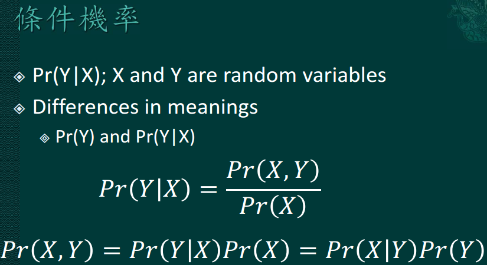
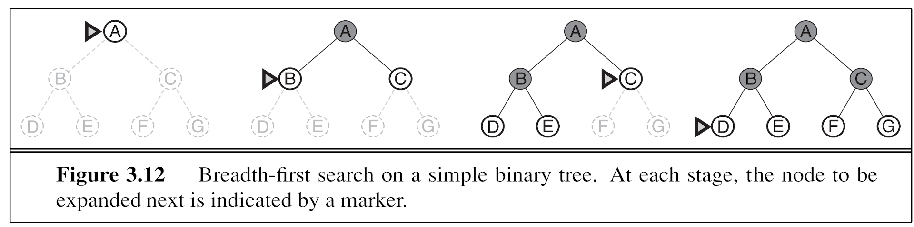
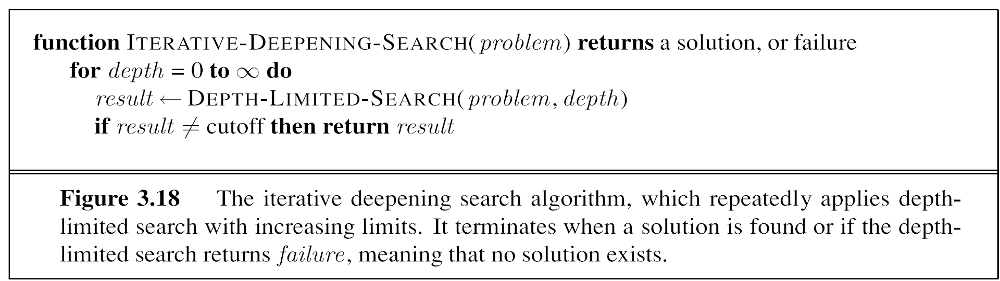
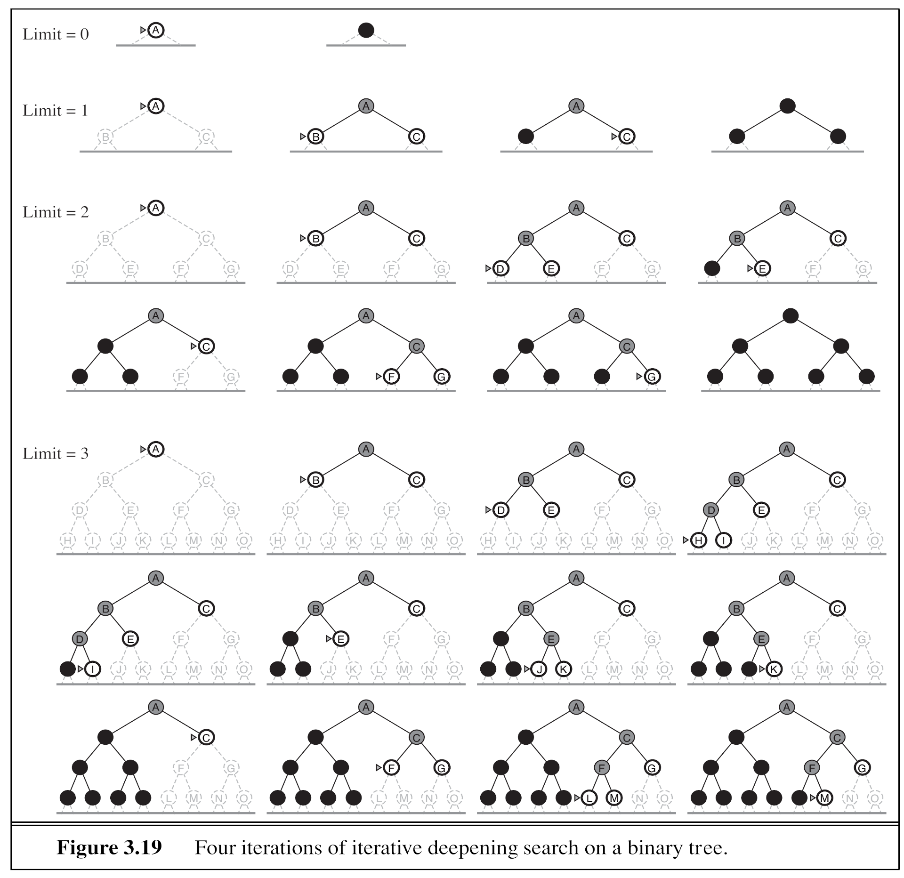
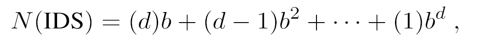
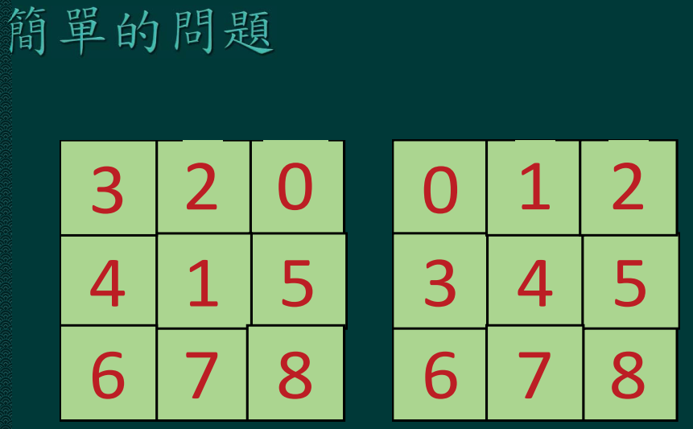

# 第三週建議作業

## 1. 延續關於「機率與疾病」的討論



* 假定Pr(C)=0.1，Pr(fever)=0.2，一個發燒病人得到肺炎的機率Pr(C|fever)是多少？
  - 計算Pr(C|fever)/Pr(C)。這一個比例增加多少倍？


```sos
;; A
(define pr:C 0.1)  ;; Pr(C)
(define pr:fever 0.2)  ;; Pr(fever)
(define pr:fever@C 0.879)  ;; Pr(fever|C)

(define pr:fever&C (* pr:fever@C pr:C))  ;; Pr(fever, C)
(define pr:C@fever (/ pr:fever&C pr:fever))  ;; Pr(C|fever) = Pr(fever, C) / Pr(fever)

(displayln (string-append "* Pr(fever|C) 是 " (number->string pr:C@fever)))
(displayln (string-append "  - Pr(C|fever) / Pr(C) 是 " (number->string (/ pr:C@fever pr:C)) " (倍)"))
```

    * Pr(fever|C) 是 0.4395
      - Pr(C|fever) / Pr(C) 是 4.395 (倍)


* 假定Pr(fever|¬C)=0.01、Pr(C)=0.1，一個發燒病人得到肺炎的機率Pr(C|fever)是多少？
  - Pr(C|fever) 還是 Pr(¬C|fever) 比較高？


```sos
;; B
(define pr:C 0.1)          ;; Pr(C)
(define pr:¬C (- 1 pr:C))  ;; Pr(¬C)
(define pr:fever 0.2)

(define pr:fever@C 0.879)  ;; Pr(fever|C)
(define pr:fever@¬C 0.01)  ;; Pr(fever|¬C)

(define pr:fever&¬C (* pr:fever@¬C pr:¬C))
(define pr:¬C@fever (/ pr:fever&¬C pr:fever))
(define pr:C@fever (- 1 pr:¬C@fever))

(displayln (string-append "* 發燒病人得到武漢肺炎 (C) 的機率是：" (number->string pr:C@fever)))
(displayln (string-append "  - 在此條件下，Pr(¬C|fever) 為 " (number->string pr:¬C@fever)))
(displayln "    故 Pr(C|fever) > Pr(¬C|fever)")
```

    * 發燒病人得到武漢肺炎 (C) 的機率是：0.955
      - 在此條件下，Pr(¬C|fever) 為 0.045000000000000005
        故 Pr(C|fever) > Pr(¬C|fever)


## 2. 比較 BFS 和 IDS
* 參考 AIMA Fig. 3.12 和相關說明 
  - 假定一個搜尋問題，每一個節點有兩個子節點
  - 利用BFS來搜尋答案的話，假定問題的答案在search tree 的第三層(層數從零開始)的話，**最多** 需要進入 Fig. 3.7 graph search 演算法中的 loop do，做幾次的 choose？


```sos
from collections import namedtuple

Node = namedtuple('Node', ['name', 'children'])
Path = namedtuple('Path', ['nodes', 'size'])

NULL = Node('', [])

def build_node(name):
    node = Node(name, [])
    return node


def build_nodes():
    cities = ['A', 'B', 'C', 'D', 'E',
              'F', 'G', 'H', 'I', 'J',
              'K', 'L', 'M', 'N', 'O']
    return {city: build_node(city) for city in cities}

        
def link_nodes(nodes, start, *ends):
    start_node = nodes[start]
    for end in ends:
        start_node.children.append(nodes[end])

def build_bfs_map():
    nodes = build_nodes()
    
    link_nodes(nodes, 'A', 'B', 'C')
    link_nodes(nodes, 'B', 'D', 'E')
    link_nodes(nodes, 'C', 'F', 'G')
    link_nodes(nodes, 'D', 'H', 'I')
    link_nodes(nodes, 'E', 'J', 'K')
    link_nodes(nodes, 'F', 'L', 'M')
    link_nodes(nodes, 'G', 'N', 'O')
    
    return nodes['A']


def valid_path(path, start_name, end_name):
    start = path.nodes[0]
    end = path.nodes[-1]

    return start.name == start_name and end.name == end_name


def extend_path(path):
    paths = []
    
    path_nodes = path.nodes
    start = path_nodes[0]
    end = path_nodes[-1]
    children_of_end = end.children

    size = path.size
    
    for child in children_of_end:
        new_nodes = path_nodes.copy()
        new_nodes.append(child)
        paths.append(Path(new_nodes, size + 1))
        
    return paths


def bfs(frontier, es, times):
    if len(frontier) == 0 or frontier is None:
        raise Exception()
    else:
        path = frontier.pop(0)

        if valid_path(path, 'A', 'O'):
            return path, times
        else:
            es.append(path)
            frontier.extend(extend_path(path))
            return bfs(frontier, es, times + 1)

start = build_bfs_map()
path, times = bfs([Path([start, start], 0)], [], 0)

print('A.')

print('BFS 路徑：')
for node in path.nodes:
    print(node.name)

print("最多需進入 loop 執行次數：", times)
```

    A.
    BFS 路徑：
    A
    A
    C
    G
    O
    最多需進入 loop 執行次數： 14


* 參考 AIMA Fig. 3.18 和 Fig. 3.19 和相關說明和 p. 90 上的計算   
  - 假定一個搜尋問題，每一個節點有兩個子節點
  - 利用IDS來搜尋答案的話，假定問題的答案在search tree 的第三層(層數從零開始)的話，**最多** 需要 choose 多少節點才會找到答案？ 
  
計算函式如下：
  
$$\sum_{n=0}^{n=d-1}(d-n)(b^{n+1})$$


```sos
(define depth 3)
(define branch 2)

(define loop-count
    (lambda (d b n)
        (if (= n 0)
            (* d b)
            (+ (* (- d n)
                  (expt b (+ n 1)))
               (loop-count d b (- n 1))))))
               
(define loops (loop-count (+ depth 1) branch depth))

(displayln (string-append "* 最多會執行 " (number->string loops)  " 次 loop"))
```

    * 最多會執行 52 次 loop


## 3. 參照 ai.ch3.dfs.bfs.pdf 第29頁投影片上的 8 puzzle 問題



* 利用AIMA書本的 h1 和 h2 來找這一 8 puzzle 問題的答案
* 思考一下，如果使用 BFS 或者 DFS 的話，所需要 expand 的節點的數目會不會多很多？


```sos

```
